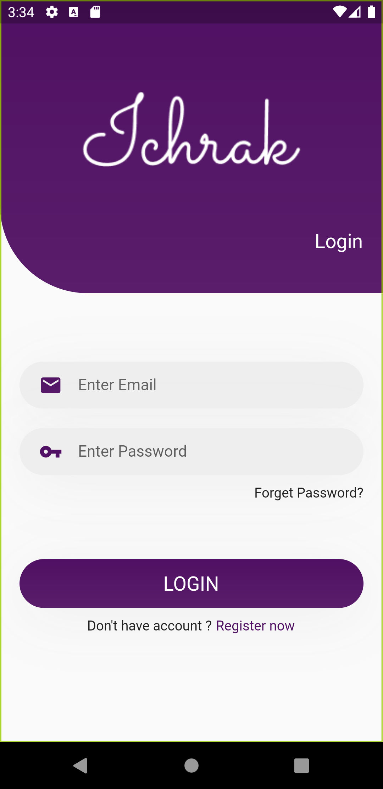
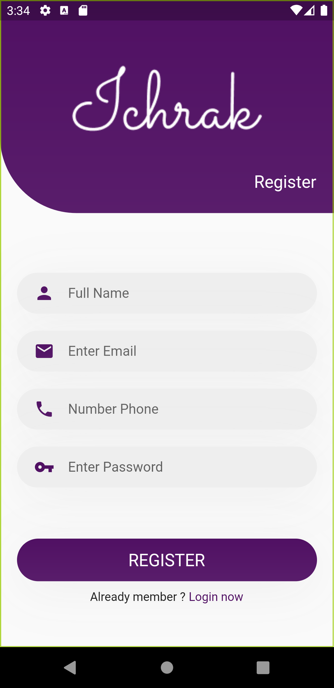

# ui_authentication

This is an examlpe of Screen splash, Login anda Regiter Page UI using #Flutter.

## Some Screenshots
<table>
<tr>
<td>Splash screen</td>
<td>Login screen</td>
<td>Register screen</td>
</tr>
<tr>
<td></td>
<td></td>
<td></td>

</tr>
</table>
## Getting Started

This project is a starting point for a Flutter application.

A few resources to get you started if this is your first Flutter project:

- [Lab: Write your first Flutter app](https://flutter.dev/docs/get-started/codelab)
- [Cookbook: Useful Flutter samples](https://flutter.dev/docs/cookbook)

For help getting started with Flutter, view our
[online documentation](https://flutter.dev/docs), which offers tutorials,
samples, guidance on mobile development, and a full API reference.
